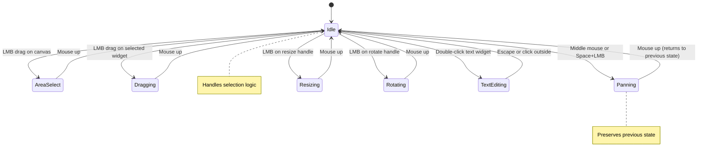

# State Machine-Based Interaction System

## Overview

We have successfully implemented a comprehensive state machine-based interaction system that provides Figma-like interactions while maintaining backward compatibility with the existing [`InteractionController`](src/managers/InteractionController.ts) interface.

## Architecture

### Core Components

1. **[`StateMachine`](src/managers/stateMachine/StateMachine.ts)** - Main state machine orchestrator
2. **[`BaseState`](src/managers/stateMachine/BaseState.ts)** - Abstract base class for all interaction states
3. **Individual States** - Specific interaction behavior implementations
4. **[`InteractionController`](src/managers/InteractionController.ts)** - Refactored to use state machine internally

### State Machine States

| State | Purpose | Triggers |
|-------|---------|----------|
| **[`IdleState`](src/managers/stateMachine/states/IdleState.ts)** | Default state, handles selection and initial interactions | Default state |
| **[`AreaSelectState`](src/managers/stateMachine/states/AreaSelectState.ts)** | Marquee selection with rectangle | LMB drag on canvas |
| **[`DraggingState`](src/managers/stateMachine/states/DraggingState.ts)** | Moving selected widgets with snapping | LMB drag on selected widget |
| **[`PanningState`](src/managers/stateMachine/states/PanningState.ts)** | Canvas panning with state preservation | Middle mouse or Space+LMB |
| **[`ResizingState`](src/managers/stateMachine/states/ResizingState.ts)** | Widget resizing with aspect ratio constraints | LMB on resize handle |
| **[`RotatingState`](src/managers/stateMachine/states/RotatingState.ts)** | Widget rotation with angle snapping | LMB on rotation handle |
| **[`TextEditingState`](src/managers/stateMachine/states/TextEditingState.ts)** | Text editing mode | Double-click on text widget |

## Key Features Implemented

### ✅ Figma-Like Interactions

- **Middle Mouse Panning**: Middle mouse button always triggers panning, preserving previous state
- **Smart Selection**: LMB click selects widgets with modifier support (Shift, Cmd/Ctrl)
- **Area Selection**: LMB drag on canvas creates marquee selection
- **Drag with Snapping**: Selected widgets can be dragged with smart snapping to other widgets and grid
- **Transform Handles**: Resize and rotation handles for selected widgets
- **Keyboard Shortcuts**: Space for hand tool, Escape to cancel operations

### ✅ State Machine Benefits

- **Clean State Isolation**: Each state handles its own mouse/keyboard events
- **Predictable Transitions**: Clear entry/exit conditions for each state
- **Context Preservation**: Panning preserves the previous state and returns to it
- **Modifier Support**: Consistent modifier key behavior across all states
- **Escape Hatch**: Escape key always cancels current operation

### ✅ Backward Compatibility

- **Legacy Interface**: Existing [`InteractionController`](src/managers/InteractionController.ts) interface maintained
- **Mode Mapping**: State machine states map to legacy interaction modes
- **Callback Preservation**: All existing callbacks continue to work
- **Gradual Migration**: Can be adopted incrementally

## Interaction Behaviors

### Mouse Interactions

| Input | Behavior |
|-------|----------|
| **LMB click on widget** | Select widget (with modifier support) |
| **LMB click on canvas** | Clear selection (unless Shift/Cmd held) |
| **LMB drag on canvas** | Start area selection |
| **LMB drag on selected widget** | Start dragging |
| **Middle mouse** | Enter panning state |
| **LMB on resize handle** | Start resizing |
| **LMB on rotation handle** | Start rotating |
| **Double-click on text widget** | Enter text editing |

### Keyboard Interactions

| Key | Behavior |
|-----|----------|
| **Space** | Toggle hand tool (panning mode) |
| **Escape** | Cancel current operation, return to idle |
| **Shift + drag** | Constrain to 45-degree angles |
| **Cmd/Ctrl + click** | Toggle selection |
| **Shift + click** | Add to selection |
| **Cmd/Meta + drag** | Disable snapping |

### Modifier Keys

- **Shift**: Constrains movement/rotation, adds to selection
- **Cmd/Ctrl**: Toggles selection, disables snapping
- **Alt**: Deep selection (future group support)

## State Transitions



## Implementation Details

### Event Flow

1. **Mouse/Keyboard Event** → [`InteractionController`](src/managers/InteractionController.ts)
2. **Event Conversion** → [`StateMachineEvent`](src/managers/stateMachine/types.ts)
3. **State Processing** → Current state handles event
4. **State Transition** → If needed, transition to new state
5. **Callback Execution** → Update UI and application state

### Context Management

The [`StateContext`](src/managers/stateMachine/types.ts) maintains shared data:
- Widget list and canvas transform
- Current selection and hover state
- Interaction-specific data (start positions, transform handles, etc.)

### Snapping System

- **Widget Snapping**: Edges, centers, and corners of other widgets
- **Grid Snapping**: 10-pixel grid alignment
- **Smart Thresholds**: Different snap strengths for different targets
- **Visual Feedback**: Snap indicators show active snap targets

## Next Steps

The remaining tasks to complete the system:

1. **Add transformation handles to WidgetContainer component**
2. **Update SelectionManager to work with new state system**
3. **Implement proper Z-index sorting for widget selection**
4. **Test and validate all interaction flows**
5. **Update documentation and examples**

## Usage Example

```typescript
// The state machine is automatically initialized in InteractionController
const controller = new InteractionController({
  onWidgetUpdate: (id, updates) => { /* handle widget updates */ },
  onSelectionChange: (ids) => { /* handle selection changes */ },
  // ... other callbacks
});

// Set canvas element to enable interactions
controller.setCanvasElement(canvasElement);

// The state machine handles all interactions automatically
// Middle mouse = panning, LMB drag = area select or widget drag, etc.
```

The system provides a robust, extensible foundation for complex canvas interactions while maintaining the simplicity of the original interface.