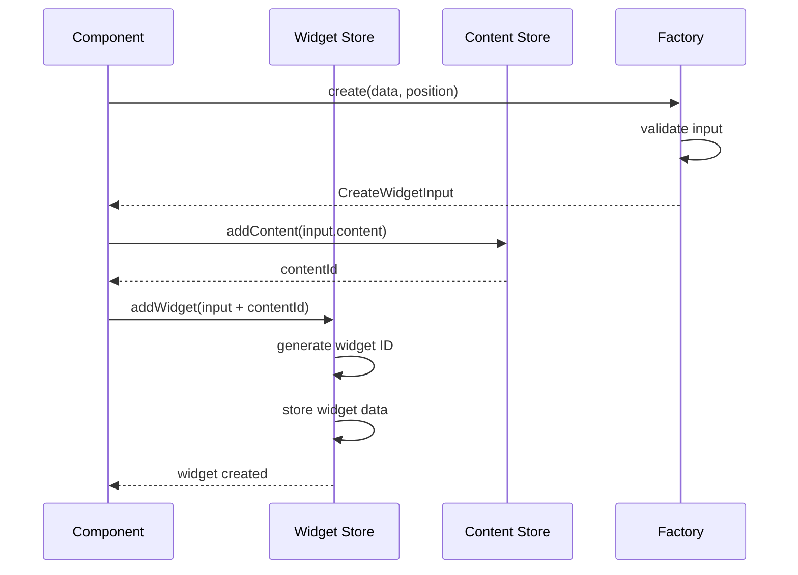
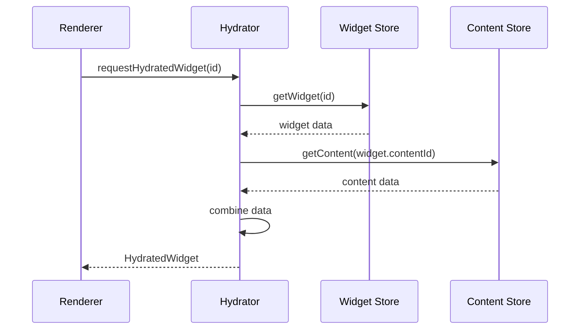

# Widget System API Reference

## Table of Contents

1. [Core Types](#core-types)
2. [Store APIs](#store-apis)
3. [Widget Lifecycle](#widget-lifecycle)
4. [Plugin System](#plugin-system)
5. [Services](#services)
6. [Utilities](#utilities)
7. [Events](#events)

---

## Core Types

### `Widget`
The core widget data structure containing positioning and metadata.

```typescript
interface Widget {
  id: string;                    // Unique widget identifier
  type: string;                  // Widget type (e.g., "todo", "note")
  x: number;                     // X position on canvas
  y: number;                     // Y position on canvas
  width: number;                 // Widget width
  height: number;                // Widget height
  rotation: number;              // Rotation in degrees
  zIndex: number;                // Z-index for layering
  locked: boolean;               // Whether widget is locked
  selected: boolean;             // Whether widget is selected
  contentId: string;             // Reference to content in content store
  metadata: Record<string, any>; // Additional metadata
  createdAt: number;             // Creation timestamp
  updatedAt: number;             // Last update timestamp
}
```

### `WidgetContent<T>`
Content data structure for widget-specific heavy data.

```typescript
interface WidgetContent<T = any> {
  id: string;              // Content identifier (hash)
  type: string;            // Content type matching widget type
  data: T;                 // Type-specific content data
  lastModified: number;    // Last modification timestamp
  size?: number;           // Content size in bytes
}
```

### `HydratedWidget<T>`
Combined widget and content data for rendering.

```typescript
interface HydratedWidget<T = any> extends Widget {
  content: WidgetContent<T>;    // Loaded content data
  isContentLoaded: boolean;     // Whether content is loaded
  contentError?: string;        // Error message if content failed to load
}
```

### `CreateWidgetInput`
Input data for creating new widgets.

```typescript
interface CreateWidgetInput {
  type: string;                  // Widget type
  x: number;                     // Initial X position
  y: number;                     // Initial Y position
  width: number;                 // Initial width
  height: number;                // Initial height
  rotation?: number;             // Initial rotation (default: 0)
  locked?: boolean;              // Initial locked state (default: false)
  metadata?: Record<string, any>; // Initial metadata (default: {})
  content: any;                  // Widget-specific content data
}
```

---

## Store APIs

### Widget Store

#### `useWidgets()`
Returns all widgets in the store.

```typescript
const useWidgets = () => Widget[];

// Usage
const widgets = useWidgets();
```

#### `useWidgetActions()`
Returns widget management actions.

```typescript
const useWidgetActions = () => {
  addWidget: (input: CreateWidgetInput) => Promise<void>;
  updateWidget: (id: string, updates: Partial<Widget>) => void;
  removeWidget: (id: string) => void;
  updateWidgetTransform: (id: string, transform: TransformUpdate) => void;
  updateMultipleWidgetTransforms: (updates: TransformUpdate[]) => void;
  selectWidget: (id: string, selected: boolean) => void;
  selectWidgets: (ids: string[], selected: boolean) => void;
  clearSelection: () => void;
  getSelectedWidgets: () => Widget[];
  getWidget: (id: string) => Widget | undefined;
  getWidgetsByType: (type: string) => Widget[];
  reorderWidget: (id: string, newZIndex: number) => void;
};

// Usage
const { addWidget, updateWidget, removeWidget } = useWidgetActions();

// Create widget
await addWidget({
  type: 'todo',
  x: 100, y: 100,
  width: 300, height: 400,
  content: { title: 'My Todo', items: [] }
});

// Update widget position
updateWidget('widget-123', { x: 150, y: 150 });

// Remove widget
removeWidget('widget-123');
```

#### Transform Updates
```typescript
interface TransformUpdate {
  id: string;
  transform: {
    x?: number;
    y?: number;
    width?: number;
    height?: number;
    rotation?: number;
  };
}

// Usage
updateWidgetTransform('widget-123', { x: 100, y: 100 });

updateMultipleWidgetTransforms([
  { id: 'widget-1', transform: { x: 100 } },
  { id: 'widget-2', transform: { y: 200 } }
]);
```

### Content Store

#### `useContent()`
Returns all content in the store.

```typescript
const useContent = () => Record<string, WidgetContent>;

// Usage
const content = useContent();
const todoContent = content['content-hash-123'];
```

#### `useContentActions()`
Returns content management actions.

```typescript
const useContentActions = () => {
  addContent: (data: any) => Promise<string>;
  getContent: (id: string) => WidgetContent | null;
  updateContent: (id: string, updates: Partial<WidgetContent>) => void;
  removeContent: (id: string) => void;
  addMultipleContent: (dataArray: any[]) => Promise<string[]>;
  getMultipleContent: (ids: string[]) => Record<string, WidgetContent | null>;
  preloadContent: (ids: string[]) => Promise<void>;
  evictContent: (ids: string[]) => void;
  cleanupCache: () => void;
  getCacheStats: () => CacheStats;
  getContentByType: (type: string) => WidgetContent[];
  findDuplicateContent: (data: any) => string | null;
};

// Usage
const { addContent, updateContent, removeContent } = useContentActions();

// Add content
const contentId = await addContent({
  title: 'My Todo List',
  items: [{ id: '1', text: 'Task 1', completed: false }]
});

// Update content
updateContent(contentId, {
  title: 'Updated Todo List'
});

// Remove content
removeContent(contentId);
```

#### Cache Management
```typescript
interface CacheStats {
  totalSize: number;
  itemCount: number;
  hitRate: number;
  lastCleanup: number;
}

// Usage
const { getCacheStats, cleanupCache } = useContentActions();
const stats = getCacheStats();
console.log(`Cache size: ${stats.totalSize} bytes`);
cleanupCache(); // Manual cleanup
```

---

## Widget Lifecycle

### Widget Creation Flow



### Widget Hydration Flow



---

## Plugin System

### `WidgetPlugin`
Base interface for widget plugins.

```typescript
interface WidgetPlugin {
  id: string;                        // Unique plugin identifier
  name: string;                      // Human-readable plugin name
  version: string;                   // Plugin version
  description: string;               // Plugin description
  author: string;                    // Plugin author
  
  types?: WidgetTypeDefinition[];    // Widget type definitions
  factories?: WidgetFactory[];       // Widget factories
  renderers?: WidgetRenderer[];      // Widget renderers
  
  install(registry: WidgetRegistry): Promise<void>;
  uninstall(registry: WidgetRegistry): Promise<void>;
}

// Usage
export class TodoPlugin implements WidgetPlugin {
  id = "todo";
  name = "Todo Widget";
  version = "1.0.0";
  description = "A todo list widget";
  author = "Your Name";
  
  factories = [new TodoFactory()];
  renderers = [{ type: "todo", component: TodoRenderer }];
  
  async install(registry: WidgetRegistry): Promise<void> {
    registry.registerFactory(this.factories[0]);
    registry.registerRenderer(this.renderers[0]);
  }
  
  async uninstall(registry: WidgetRegistry): Promise<void> {
    registry.unregisterFactory("todo");
    registry.unregisterRenderer("todo");
  }
}
```

### `WidgetFactory<T>`
Factory interface for creating widgets.

```typescript
interface WidgetFactory<T = any> {
  type: string;                      // Widget type handled by factory
  
  canHandle(data: any): boolean;     // Whether factory can handle input
  create(data: any, position: Position): Promise<CreateWidgetInput>;
  validate?(widget: HydratedWidget<T>): WidgetValidationResult;
  serialize?(widget: HydratedWidget<T>, options: SerializationOptions): Promise<WidgetExportData>;
  deserialize?(data: WidgetExportData): Promise<HydratedWidget<T>>;
  getDefaultSize(): { width: number; height: number };
  getCapabilities(): WidgetCapabilities;
}

// Usage
export class TodoFactory implements WidgetFactory<TodoContent> {
  type = "todo";
  
  canHandle(data: any): boolean {
    return data.type === "todo" || data.todo === true;
  }
  
  async create(data: any, position: Position): Promise<CreateWidgetInput> {
    return {
      type: this.type,
      x: position.x,
      y: position.y,
      width: 300,
      height: 400,
      content: {
        title: data.title || "New Todo",
        items: data.items || []
      }
    };
  }
  
  getDefaultSize() {
    return { width: 300, height: 400 };
  }
  
  getCapabilities(): WidgetCapabilities {
    return {
      canResize: true,
      canRotate: false,
      canEdit: true,
      canConfigure: true,
      canGroup: true,
      canDuplicate: true,
      canExport: true,
      hasContextMenu: true,
      hasToolbar: true,
      hasInspector: true
    };
  }
}
```

### `WidgetRenderer<T>`
Renderer interface for displaying widgets.

```typescript
interface WidgetRenderer<T = any> {
  type: string;                      // Widget type handled by renderer
  component: React.ComponentType<WidgetRendererProps<T>>;
  toolbar?: React.ComponentType<WidgetToolbarProps<T>>;
  inspector?: React.ComponentType<WidgetInspectorProps<T>>;
  contextMenu?: React.ComponentType<WidgetContextMenuProps<T>>;
}

interface WidgetRendererProps<T = any> {
  widget: HydratedWidget<T>;         // Widget with loaded content
  state: WidgetRenderState;          // Render state
  events: WidgetEvents;              // Event handlers
  canvasTransform: CanvasTransform;  // Canvas transform
}

// Usage
export const TodoRenderer: React.FC<WidgetRendererProps<TodoContent>> = ({ 
  widget, 
  state, 
  events 
}) => {
  const { title, items } = widget.content;
  
  if (!widget.isContentLoaded) {
    return <div>Loading...</div>;
  }
  
  return (
    <div className="todo-widget">
      <h3>{title}</h3>
      {items.map(item => (
        <div key={item.id}>{item.text}</div>
      ))}
    </div>
  );
};
```

---

## Services

### Widget Hydrator

#### `useHydratedWidget<T>(id: string)`
Returns a hydrated widget by ID.

```typescript
const useHydratedWidget = <T>(id: string) => HydratedWidget<T> | null;

// Usage
const widget = useHydratedWidget<TodoContent>('widget-123');
if (widget?.isContentLoaded) {
  console.log(widget.content.title);
}
```

#### `useHydratedWidgets()`
Returns all hydrated widgets.

```typescript
const useHydratedWidgets = () => HydratedWidget[];

// Usage
const widgets = useHydratedWidgets();
const todoWidgets = widgets.filter(w => w.type === 'todo');
```

### Widget Registry

#### `getWidgetRegistry()`
Returns the global widget registry.

```typescript
const getWidgetRegistry = () => WidgetRegistry;

interface WidgetRegistry {
  registerType(definition: WidgetTypeDefinition): void;
  unregisterType(type: string): void;
  getType(type: string): WidgetTypeDefinition | undefined;
  getAllTypes(): WidgetTypeDefinition[];
  getTypesByCategory(category: string): WidgetTypeDefinition[];
  
  registerFactory<T>(factory: WidgetFactory<T>): void;
  unregisterFactory(type: string): void;
  getFactory<T>(type: string): WidgetFactory<T> | undefined;
  
  registerRenderer<T>(renderer: WidgetRenderer<T>): void;
  unregisterRenderer(type: string): void;
  getRenderer<T>(type: string): WidgetRenderer<T> | undefined;
}

// Usage
const registry = getWidgetRegistry();
registry.registerFactory(new TodoFactory());
registry.registerRenderer({ type: "todo", component: TodoRenderer });
```

---

## Utilities

### Widget Validation

```typescript
interface WidgetValidationResult {
  isValid: boolean;
  errors: string[];
  warnings: string[];
}

// Usage in factory
validate(widget: HydratedWidget<TodoContent>): WidgetValidationResult {
  const errors: string[] = [];
  const warnings: string[] = [];
  
  if (!widget.content.title) {
    errors.push("Title is required");
  }
  
  if (widget.content.items.length === 0) {
    warnings.push("Todo list is empty");
  }
  
  return {
    isValid: errors.length === 0,
    errors,
    warnings
  };
}
```

### Widget Capabilities

```typescript
interface WidgetCapabilities {
  canResize: boolean;        // Can be resized
  canRotate: boolean;        // Can be rotated
  canEdit: boolean;          // Can be edited inline
  canConfigure: boolean;     // Has configuration panel
  canGroup: boolean;         // Can be grouped with others
  canDuplicate: boolean;     // Can be duplicated
  canExport: boolean;        // Can be exported
  hasContextMenu: boolean;   // Has context menu
  hasToolbar: boolean;       // Has toolbar
  hasInspector: boolean;     // Has inspector panel
}
```

### Widget Export/Import

```typescript
interface WidgetExportData {
  widget: HydratedWidget;
  assets?: Array<{
    id: string;
    type: string;
    data: string | ArrayBuffer;
    mimeType: string;
  }>;
  dependencies?: string[];
}

interface SerializationOptions {
  includeMetadata: boolean;
  includeContent: boolean;
  compressImages: boolean;
  format: "json" | "binary";
}

// Usage
const exportData = await factory.serialize(widget, {
  includeMetadata: true,
  includeContent: true,
  compressImages: true,
  format: "json"
});

const importedWidget = await factory.deserialize(exportData);
```

---

## Events

### Widget Events

```typescript
interface WidgetEvents {
  onUpdate: (updates: Partial<Widget>) => void;
  onDelete: () => void;
  onDuplicate: () => void;
  onEdit: () => void;
  onConfigure: () => void;
  onSelect: () => void;
  onDeselect: () => void;
  onHover: () => void;
  onUnhover: () => void;
}

// Usage in renderer
const TodoRenderer: React.FC<WidgetRendererProps<TodoContent>> = ({ 
  widget, 
  events 
}) => {
  const handleEdit = () => {
    events.onEdit();
  };
  
  const handleDelete = () => {
    events.onDelete();
  };
  
  return (
    <div>
      <button onClick={handleEdit}>Edit</button>
      <button onClick={handleDelete}>Delete</button>
    </div>
  );
};
```

### Canvas Events

```typescript
interface CanvasEvents {
  onWidgetAdd: (widget: CreateWidgetInput) => void;
  onWidgetUpdate: (id: string, updates: Partial<Widget>) => void;
  onWidgetRemove: (id: string) => void;
  onWidgetsUpdate: (updates: Array<{id: string, updates: Partial<Widget>}>) => void;
  onCanvasTransform: (transform: CanvasTransform) => void;
}

interface CanvasTransform {
  x: number;     // Pan X
  y: number;     // Pan Y
  scale: number; // Zoom scale
}
```

---

## Error Handling

### Common Error Types

```typescript
// Widget not found
class WidgetNotFoundError extends Error {
  constructor(id: string) {
    super(`Widget with ID "${id}" not found`);
  }
}

// Content not found
class ContentNotFoundError extends Error {
  constructor(contentId: string) {
    super(`Content with ID "${contentId}" not found`);
  }
}

// Factory not found
class FactoryNotFoundError extends Error {
  constructor(type: string) {
    super(`Factory for widget type "${type}" not found`);
  }
}

// Renderer not found
class RendererNotFoundError extends Error {
  constructor(type: string) {
    super(`Renderer for widget type "${type}" not found`);
  }
}
```

### Error Handling in Components

```typescript
const TodoRenderer: React.FC<WidgetRendererProps<TodoContent>> = ({ widget }) => {
  try {
    if (!widget.isContentLoaded) {
      return <div>Loading...</div>;
    }
    
    if (widget.contentError) {
      return <div>Error: {widget.contentError}</div>;
    }
    
    return <div>{/* Normal rendering */}</div>;
  } catch (error) {
    console.error('Widget rendering error:', error);
    return <div>Widget rendering failed</div>;
  }
};
```

---

## Performance Optimization

### Memoization

```typescript
// Memoize expensive computations
const TodoRenderer: React.FC<WidgetRendererProps<TodoContent>> = React.memo(({ widget }) => {
  const completedCount = useMemo(() => {
    return widget.content.items.filter(item => item.completed).length;
  }, [widget.content.items]);
  
  return <div>Completed: {completedCount}</div>;
});
```

### Batch Updates

```typescript
const { updateMultipleWidgetTransforms } = useWidgetActions();

// Batch transform updates for better performance
const updates = selectedWidgets.map(widget => ({
  id: widget.id,
  transform: { x: widget.x + deltaX, y: widget.y + deltaY }
}));

updateMultipleWidgetTransforms(updates);
```

### Content Preloading

```typescript
const { preloadContent } = useContentActions();

// Preload content for better performance
useEffect(() => {
  const contentIds = widgets.map(w => w.contentId);
  preloadContent(contentIds);
}, [widgets]);
```

This API reference provides comprehensive documentation for all public interfaces and methods in the widget system. Use it as a reference when developing widgets or working with the widget system.