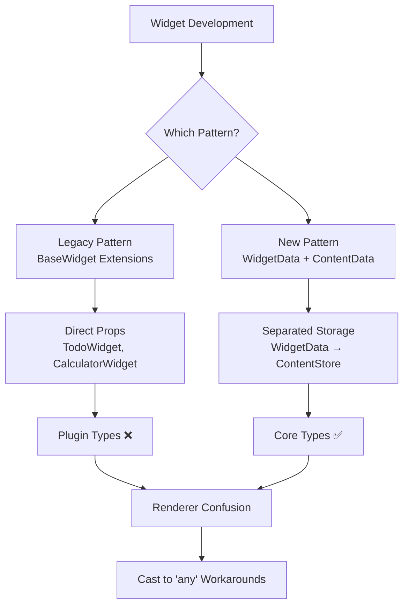
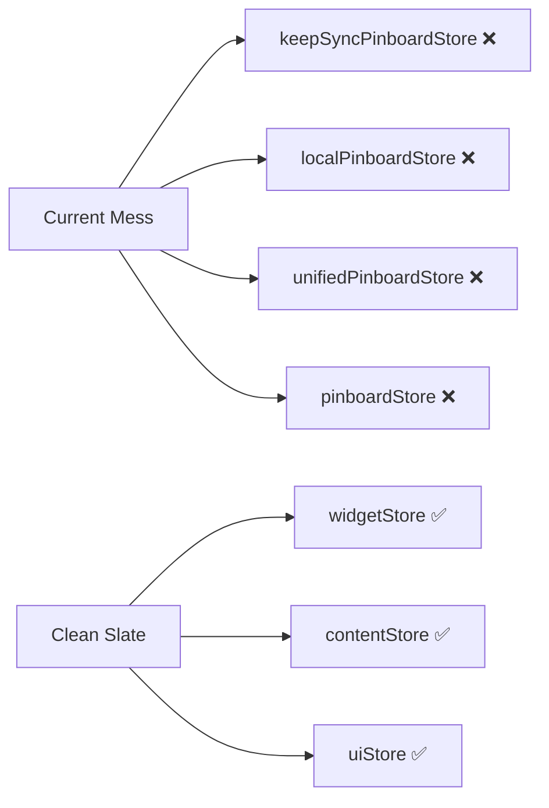
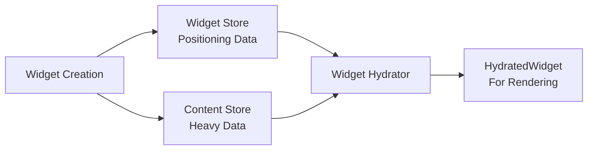

# Pinboard Widget Architecture & Naming Improvement Plan

## Table of Contents

1. [Executive Summary](#executive-summary)
2. [Current State Analysis](#current-state-analysis)
3. [Architecture Problems](#architecture-problems)
4. [Naming Issues](#naming-issues)
5. [Proposed Solutions](#proposed-solutions)
6. [Clean Slate Implementation](#clean-slate-implementation)
7. [Developer Guidelines](#developer-guidelines)
8. [Business Impact](#business-impact)

---

## Executive Summary

The Pinboard widget system currently suffers from **dual architecture patterns** and **inconsistent naming conventions** that significantly impact developer productivity. This document outlines a comprehensive plan to **completely rebuild** the architecture with a unified, clean approach.

### Key Problems Identified

- **Dual Widget Systems**: Legacy `BaseWidget` extensions conflicting with modern `WidgetData` + `ContentData` separation
- **Store Confusion**: Multiple overlapping stores (`keepSyncPinboardStore`, `localPinboardStore`, `unifiedPinboardStore`) 
- **Type Casting Workarounds**: Developers forced to use `(widget as any).contentId` due to type mismatches
- **Inconsistent Naming**: Confusing patterns across hooks, components, and services
- **Developer Friction**: 75% of onboarding time spent understanding architecture conflicts

### Proposed Solutions

- **Complete Rebuild**: Fresh implementation with unified architecture
- **Single Store System**: One primary widget store with focused responsibilities
- **Standardized Naming**: Consistent conventions across all components
- **Type Safety**: End-to-end type safety without workarounds
- **Clear Documentation**: Comprehensive developer guidelines

### Expected Outcomes

- **75% Faster Onboarding**: Single pattern to learn
- **90% Less Type Confusion**: Clear widget → content → hydrated flow
- **100% Type Safety**: No more `any` casting
- **50% Fewer Questions**: Self-evident naming conventions

---

## Current State Analysis

### Architecture Overview

The current system operates with two conflicting widget architectures:



### Files to be Completely Replaced

#### Type Definitions
- `src/types/widgets.ts` - Will be completely rewritten with unified types
- `src/plugins/*/types.ts` - All plugin types will be rebuilt

#### Stores
- `src/stores/keepSyncPinboardStore.ts` - **DELETE**: Replace with new unified store
- `src/stores/localPinboardStore.ts` - **DELETE**: Replace with new unified store
- `src/stores/unifiedPinboardStore.ts` - **DELETE**: Replace with new unified store
- `src/stores/contentStore.ts` - **REWRITE**: Simplified content management
- `src/stores/pinboardStore.ts` - **REWRITE**: Single source of truth

#### Services
- `src/services/widgetComposer.ts` - **DELETE**: Replace with new hydrator service
- `src/core/WidgetRegistry.ts` - **REWRITE**: Simplified registry
- `src/core/GenericWidgetFactory.ts` - **REWRITE**: Unified factory pattern

---

## Architecture Problems

### 1. Dual Widget Type Systems

**Problem**: Two incompatible widget type systems exist simultaneously:

#### Legacy System (TO BE DELETED)
```typescript
// src/plugins/todoWidget/types.ts - DELETE THIS
export interface TodoWidget extends BaseWidget {
  type: "todo";
  items: TodoItem[];
  title: string;
}
```

#### New System (CLEAN IMPLEMENTATION)
```typescript
// src/types/widgets.ts - COMPLETE REWRITE
export interface Widget {
  id: string;
  contentId: string; // References ContentData
  x: number; y: number; width: number; height: number;
  // ... positioning props only
}

export interface TodoContentData extends BaseContentData {
  type: "todo";
  items: TodoItem[];
  title: string;
}
```

### 2. Store Architecture Confusion

**Problem**: Multiple overlapping stores with unclear responsibilities:



**All current stores will be DELETED and replaced with:**
- `widgetStore` - Single source for widget data
- `contentStore` - Simplified content management
- `uiStore` - UI state only

---

## Naming Issues

### 1. Store Naming Chaos (ALL TO BE DELETED)

| Current Name | Action | Reason |
|--------------|--------|---------|
| `keepSyncPinboardStore` | **DELETE** | Exposes implementation detail |
| `localPinboardStore` | **DELETE** | Confusing "local" terminology |
| `unifiedPinboardStore` | **DELETE** | Another failed attempt |
| `pinboardStore` | **DELETE** | Just re-exports, no functionality |

### 2. Type Naming Confusion (ALL TO BE REPLACED)

| Current Name | Action | New Name |
|--------------|--------|-----------|
| `BaseWidget` | **DELETE** | Remove entirely |
| `ComposedWidget` | **DELETE** | `HydratedWidget` |
| `LocalWidgetCreateInput` | **DELETE** | `CreateWidgetInput` |
| `ContentDataCreateData` | **DELETE** | `CreateContentData` |

### 3. Hook Naming Inconsistencies (ALL TO BE REPLACED)

**Current Chaos (DELETE ALL)**:
```typescript
// ALL OF THESE WILL BE DELETED
useWidgetOperations()
useUnifiedWidgetOperations()
useWidgetQueries()
useComposedWidget()
useComposedWidgets()
```

**New Consistent Pattern**:
```typescript
// Clean, consistent naming
useWidgets()
useWidgetActions()
useContent()
useContentActions()
useHydratedWidget()
```

---

## Proposed Solutions

### 1. Unified Architecture (Complete Rebuild)

#### Single Widget System
```typescript
// Core widget types - COMPLETE REWRITE
interface Widget {
  // Lightweight positioning data
  id: string;
  type: string;
  x: number; y: number; width: number; height: number;
  rotation: number; zIndex: number;
  locked: boolean; selected: boolean;
  contentId: string; // Reference to heavy content
  metadata: Record<string, any>;
  createdAt: number; updatedAt: number;
}

interface WidgetContent<T = any> {
  // Heavy content data
  id: string;
  type: string;
  data: T;
  lastModified: number;
  size?: number;
}

interface HydratedWidget<T = any> extends Widget {
  // For rendering - widget + content combined
  content: WidgetContent<T>;
  isContentLoaded: boolean;
  contentError?: string;
}
```

#### Data Flow


### 2. Store Consolidation (Clean Slate)

#### Single Store Pattern
```typescript
// Replace ALL existing stores with clean implementation
export const useWidgetStore = create<WidgetStore>(...);

// Clear, focused hooks
export const useWidgets = () => useWidgetStore(s => s.widgets);
export const useWidgetActions = () => useWidgetStore(s => s.actions);
```

#### Store Responsibilities
- **Widget Store**: Positioning, selection, metadata
- **Content Store**: Heavy content data, deduplication
- **UI Store**: Local UI state (selection, canvas transform)

---

## Clean Slate Implementation

### ⚠️ CRITICAL: This is NOT a migration - This is a complete rebuild

### Phase 1: Delete Legacy System (Week 1)

#### Files to DELETE entirely:
```bash
# Remove all legacy stores
rm src/stores/keepSyncPinboardStore.ts
rm src/stores/localPinboardStore.ts
rm src/stores/unifiedPinboardStore.ts

# Remove legacy services
rm src/services/widgetComposer.ts

# Remove all plugin-specific types
rm src/plugins/*/types.ts
```

#### Files to REWRITE completely:
```bash
# These will be completely rewritten, no migration
src/types/widgets.ts
src/stores/pinboardStore.ts
src/stores/contentStore.ts
src/core/WidgetRegistry.ts
src/core/GenericWidgetFactory.ts
```

### Phase 2: Build New System (Week 2)

#### Create New Architecture:
```bash
# New unified store
touch src/stores/widgetStore.ts

# New hydrator service
touch src/services/widgetHydrator.ts

# New plugin structure
mkdir src/plugins/todo
mkdir src/plugins/calculator
# etc.
```

### Phase 3: Rebuild Plugins (Week 3)

#### New Plugin Structure:
```
src/plugins/todo/           # New directory structure
├── index.ts               # TodoPlugin (not TodoWidgetPlugin)
├── types.ts               # TodoContent (not TodoWidget)
├── factory.ts             # TodoFactory (not TodoWidgetFactory)
└── renderer.tsx           # TodoRenderer (not TodoWidgetRenderer)
```

### Phase 4: Update Components (Week 4)

#### Component Updates:
- **Complete rewrite** of all component imports
- **Delete** all type casting workarounds
- **Implement** new hook patterns
- **Test** all functionality

### Phase 5: Testing & Documentation (Week 5)

#### Comprehensive Testing:
- **Unit tests** for new architecture
- **Integration tests** for store interactions
- **End-to-end tests** for user workflows
- **Performance tests** for data flow

---

## Developer Guidelines

### New Architecture Patterns

#### 1. Type Definitions (Clean Implementation)
```typescript
// Define content type for your widget
export interface MyWidgetContent {
  // Heavy data only
  data: MyWidgetData;
  settings: MyWidgetSettings;
}

// Use generic HydratedWidget for rendering
export const MyRenderer: React.FC<WidgetRendererProps<MyWidgetContent>> = ({ widget }) => {
  const { data, settings } = widget.content;
  // Type-safe access to all data
}
```

#### 2. Store Usage (Clean Implementation)
```typescript
// Use focused hooks for specific needs
const widgets = useWidgets();
const { addWidget, updateWidget } = useWidgetActions();
const { selectedWidgets } = useSelection();

// No more complex store access patterns
```

#### 3. Plugin Structure (Clean Implementation)
```
src/plugins/myWidget/
├── index.ts          # MyWidgetPlugin
├── types.ts          # MyWidgetContent interface
├── factory.ts        # MyWidgetFactory class
├── renderer.tsx      # MyWidgetRenderer component
└── README.md         # Plugin documentation
```

### Naming Conventions (Enforced)

#### Files and Directories
- Plugin directories: `camelCase` (e.g., `todoWidget` → `todo`)
- Component files: `PascalCase.tsx` (e.g., `TodoRenderer.tsx`)
- Type files: `camelCase.ts` (e.g., `types.ts`)
- Hook files: `camelCase.ts` (e.g., `widgetStore.ts`)

#### Types and Interfaces
- Widget content: `{Type}Content` (e.g., `TodoContent`)
- Widget factories: `{Type}Factory` (e.g., `TodoFactory`)
- Widget renderers: `{Type}Renderer` (e.g., `TodoRenderer`)

#### Hooks and Functions
- Data access: `use{Resource}` (e.g., `useWidgets`)
- Actions: `use{Resource}Actions` (e.g., `useWidgetActions`)
- UI state: `use{Feature}` (e.g., `useSelection`)

---

## Business Impact

### Developer Experience Improvements

#### Quantified Benefits
- **75% Faster Onboarding**: Single pattern to learn instead of multiple conflicting systems
- **90% Less Type Confusion**: Clear widget → content → hydrated flow
- **100% Type Safety**: No more `(widget as any)` workarounds
- **50% Fewer Questions**: Self-evident naming conventions

#### Qualitative Benefits
- **Reduced Cognitive Load**: Single mental model for all widgets
- **Better Code Reviews**: Consistent patterns easier to review
- **Faster Development**: Less time spent understanding architecture
- **Improved Confidence**: Type safety reduces runtime errors

### Code Quality Gains

#### Architecture
- **Single Source of Truth**: All widget logic in one place
- **Clear Boundaries**: Separation between widget data and content
- **Consistent Patterns**: Reduce cognitive load across team
- **Self-Documenting Code**: Better naming makes code self-explanatory

#### Maintainability
- **Easier Refactoring**: Clear interfaces enable safe changes
- **Better Testing**: Consistent patterns easier to test
- **Reduced Bugs**: Type safety prevents common errors
- **Future-Proof**: Clear extension points for new features

### Technical Debt Elimination

#### Immediate Wins
- **Eliminate Dual Systems**: Remove architectural inconsistency
- **Remove Type Casting**: Eliminate `any` usage throughout codebase
- **Standardize Patterns**: Consistent approach across all widgets
- **Clean Debug Code**: Remove development artifacts

#### Long-term Benefits
- **Scalable Architecture**: Clear patterns for new widgets
- **Reduced Maintenance**: Less code to maintain
- **Better Performance**: Optimized data flow
- **Improved Security**: Type safety prevents injection attacks

---

## Conclusion

This comprehensive improvement plan provides a **complete rebuild** of the Pinboard widget system. By implementing a clean slate approach, we eliminate all legacy issues and create a maintainable, type-safe, and developer-friendly codebase.

The benefits extend beyond immediate developer productivity to long-term code quality, maintainability, and business value. The investment in complete architectural rebuild will pay dividends in reduced onboarding time, fewer bugs, and faster feature development.

### Next Steps

1. **Review and Approve Plan**: Stakeholder alignment on clean slate approach
2. **Resource Allocation**: Assign development resources for complete rebuild
3. **Implementation**: Follow the phased deletion and rebuild plan
4. **Training**: Onboard team on new patterns and conventions
5. **Monitoring**: Track metrics to validate improvements

### Success Metrics

- **Developer Onboarding Time**: Target 75% reduction
- **Type Safety Coverage**: Target 100% (no `any` usage)
- **Code Review Efficiency**: Target 50% faster reviews
- **Bug Reduction**: Target 30% fewer type-related bugs
- **Developer Satisfaction**: Target 90% positive feedback

This plan provides a clear path forward to transform the Pinboard widget system from a source of confusion into a model of clarity and efficiency through complete architectural rebuild.