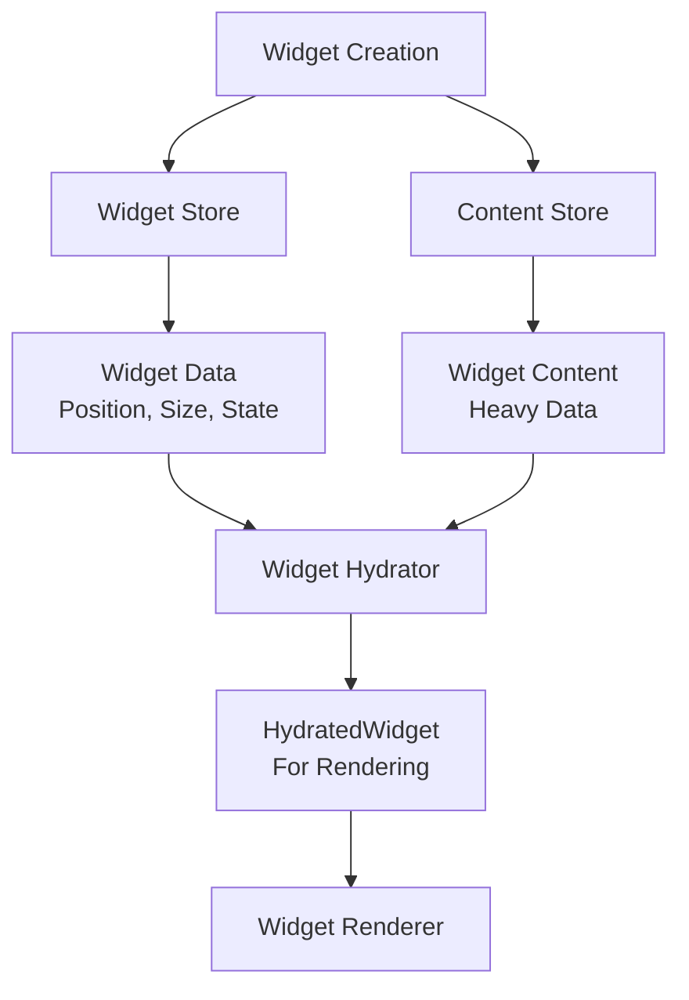
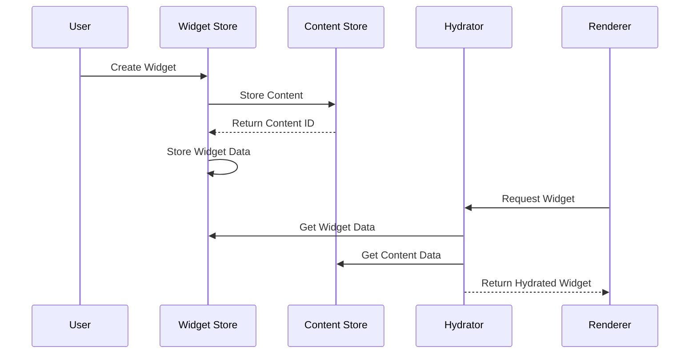

# Widget Development Guide

## Table of Contents

1. [Quick Start](#quick-start)
2. [Architecture Overview](#architecture-overview)
3. [Creating a Widget](#creating-a-widget)
4. [Best Practices](#best-practices)
5. [Common Patterns](#common-patterns)
6. [Troubleshooting](#troubleshooting)
7. [API Reference](#api-reference)

---

## Quick Start

### Prerequisites

- Node.js 18+
- TypeScript knowledge
- React experience
- Familiarity with Zustand stores

### Creating Your First Widget

```bash
# 1. Create widget directory
mkdir src/plugins/myWidget
cd src/plugins/myWidget

# 2. Create required files
touch index.ts types.ts factory.ts renderer.tsx
```

### Basic Widget Structure

```typescript
// types.ts
export interface MyWidgetContent {
  title: string;
  data: any;
}

// factory.ts
export class MyWidgetFactory implements WidgetFactory<MyWidgetContent> {
  type = "myWidget";
  
  async create(input: any, position: Position): Promise<CreateWidgetInput> {
    return {
      type: this.type,
      ...position,
      width: 200,
      height: 150,
      content: {
        title: input.title || "New Widget",
        data: input.data || {}
      }
    };
  }
}

// renderer.tsx
export const MyWidgetRenderer: React.FC<WidgetRendererProps<MyWidgetContent>> = ({ widget }) => {
  const { title, data } = widget.content;
  
  return (
    <div className="p-4 bg-white rounded-lg shadow">
      <h3 className="font-bold">{title}</h3>
      <div>{JSON.stringify(data)}</div>
    </div>
  );
};

// index.ts
export class MyWidgetPlugin implements WidgetPlugin {
  id = "my-widget";
  name = "My Widget";
  version = "1.0.0";
  
  factories = [new MyWidgetFactory()];
  renderers = [{ type: "myWidget", component: MyWidgetRenderer }];
  
  async install(): Promise<void> {
    console.log("Installing My Widget");
  }
}
```

---

## Architecture Overview

### Widget System Architecture



### Core Concepts

#### 1. Widget Data
Lightweight data stored in the widget store:
- Position (x, y)
- Size (width, height)
- Transform (rotation, zIndex)
- State (selected, locked)
- Content reference (contentId)

#### 2. Widget Content
Heavy data stored in the content store:
- Widget-specific data
- User content
- Settings and configuration
- Cached resources

#### 3. Hydrated Widget
Combined widget data and content for rendering:
- All widget data properties
- Loaded content data
- Loading state
- Error handling

### Data Flow



---

## Creating a Widget

### Step 1: Define Content Type

```typescript
// types.ts
export interface MyWidgetContent {
  // Define the heavy data your widget needs
  title: string;
  items: MyWidgetItem[];
  settings: MyWidgetSettings;
}

export interface MyWidgetItem {
  id: string;
  text: string;
  completed: boolean;
}

export interface MyWidgetSettings {
  theme: 'light' | 'dark';
  showCounter: boolean;
}
```

### Step 2: Create Factory

```typescript
// factory.ts
import { WidgetFactory, CreateWidgetInput } from '../../types/widgets';

export class MyWidgetFactory implements WidgetFactory<MyWidgetContent> {
  type = "myWidget";

  canHandle(data: any): boolean {
    return data.type === this.type || data.myWidget === true;
  }

  async create(input: any, position: Position): Promise<CreateWidgetInput> {
    return {
      type: this.type,
      x: position.x,
      y: position.y,
      width: this.getDefaultSize().width,
      height: this.getDefaultSize().height,
      content: {
        title: input.title || "New Widget",
        items: input.items || [],
        settings: {
          theme: 'light',
          showCounter: true,
          ...input.settings
        }
      }
    };
  }

  getDefaultSize(): { width: number; height: number } {
    return { width: 300, height: 200 };
  }

  getCapabilities(): WidgetCapabilities {
    return {
      canResize: true,
      canRotate: false,
      canEdit: true,
      canConfigure: true,
      canGroup: true,
      canDuplicate: true,
      canExport: true,
      hasContextMenu: true,
      hasToolbar: true,
      hasInspector: true,
    };
  }
}
```

### Step 3: Create Renderer

```typescript
// renderer.tsx
import React, { useState, useCallback } from 'react';
import { WidgetRendererProps } from '../../types/widgets';
import { useContentActions } from '../../stores/contentStore';
import { MyWidgetContent } from './types';

export const MyWidgetRenderer: React.FC<WidgetRendererProps<MyWidgetContent>> = ({ 
  widget, 
  state, 
  events 
}) => {
  const { updateContent } = useContentActions();
  const [isEditing, setIsEditing] = useState(false);
  
  const handleTitleChange = useCallback((newTitle: string) => {
    updateContent(widget.contentId, {
      title: newTitle
    });
  }, [widget.contentId, updateContent]);

  const handleAddItem = useCallback((text: string) => {
    const newItem = {
      id: Date.now().toString(),
      text,
      completed: false
    };
    
    updateContent(widget.contentId, {
      items: [...widget.content.items, newItem]
    });
  }, [widget.contentId, widget.content.items, updateContent]);

  const { title, items, settings } = widget.content;

  return (
    <div className={`p-4 rounded-lg ${
      settings.theme === 'dark' ? 'bg-gray-800 text-white' : 'bg-white text-black'
    }`}>
      {/* Title */}
      {isEditing ? (
        <input
          value={title}
          onChange={(e) => handleTitleChange(e.target.value)}
          onBlur={() => setIsEditing(false)}
          className="w-full text-lg font-bold bg-transparent border-b"
          autoFocus
        />
      ) : (
        <h3 
          className="text-lg font-bold cursor-pointer"
          onClick={() => setIsEditing(true)}
        >
          {title}
        </h3>
      )}
      
      {/* Counter */}
      {settings.showCounter && (
        <div className="text-sm text-gray-500">
          {items.length} items
        </div>
      )}
      
      {/* Items */}
      <div className="mt-2 space-y-1">
        {items.map(item => (
          <div key={item.id} className="flex items-center gap-2">
            <input
              type="checkbox"
              checked={item.completed}
              onChange={(e) => {
                const updatedItems = items.map(i => 
                  i.id === item.id ? { ...i, completed: e.target.checked } : i
                );
                updateContent(widget.contentId, { items: updatedItems });
              }}
            />
            <span className={item.completed ? 'line-through' : ''}>
              {item.text}
            </span>
          </div>
        ))}
      </div>
      
      {/* Add Item */}
      <button
        onClick={() => handleAddItem(`New item ${items.length + 1}`)}
        className="mt-2 px-3 py-1 bg-blue-500 text-white rounded text-sm"
      >
        Add Item
      </button>
    </div>
  );
};
```

### Step 4: Create Plugin

```typescript
// index.ts
import { WidgetPlugin, WidgetTypeDefinition } from '../../types/widgets';
import { MyWidgetFactory } from './factory';
import { MyWidgetRenderer } from './renderer';

export class MyWidgetPlugin implements WidgetPlugin {
  id = "my-widget";
  name = "My Widget";
  version = "1.0.0";
  description = "A sample widget for demonstration";
  author = "Your Name";

  types: WidgetTypeDefinition[] = [
    {
      type: "myWidget",
      name: "My Widget",
      description: "A sample widget for demonstration",
      icon: "📱",
      category: "app",
      defaultSize: { width: 300, height: 200 },
      minSize: { width: 200, height: 150 },
      maxSize: { width: 600, height: 400 },
      aspectRatioLocked: false,
      resizable: true,
      rotatable: true,
      configurable: true,
    }
  ];

  factories = [new MyWidgetFactory()];
  renderers = [{ type: "myWidget", component: MyWidgetRenderer }];

  async install(): Promise<void> {
    console.log(`Installing ${this.name} v${this.version}`);
  }

  async uninstall(): Promise<void> {
    console.log(`Uninstalling ${this.name}`);
  }
}

// Export everything
export const myWidgetPlugin = new MyWidgetPlugin();
export { MyWidgetFactory } from './factory';
export { MyWidgetRenderer } from './renderer';
export type { MyWidgetContent } from './types';
```

### Step 5: Register Plugin

```typescript
// In your main app file
import { myWidgetPlugin } from './plugins/myWidget';
import { getWidgetRegistry } from './core/WidgetRegistry';

const registry = getWidgetRegistry();
await myWidgetPlugin.install(registry);
```

---

## Best Practices

### 1. Type Safety

```typescript
// ✅ Good - Strong typing
interface TodoContent {
  items: TodoItem[];
  title: string;
}

const TodoRenderer: React.FC<WidgetRendererProps<TodoContent>> = ({ widget }) => {
  const { items, title } = widget.content; // Type-safe access
};

// ❌ Bad - Any casting
const TodoRenderer: React.FC<WidgetRendererProps> = ({ widget }) => {
  const items = (widget as any).items; // Unsafe
};
```

### 2. Content Updates

```typescript
// ✅ Good - Use content store
const { updateContent } = useContentActions();

const handleUpdate = (newData: Partial<MyWidgetContent>) => {
  updateContent(widget.contentId, newData);
};

// ❌ Bad - Direct widget updates
const { updateWidget } = useWidgetActions();

const handleUpdate = (newData: any) => {
  updateWidget(widget.id, newData); // Wrong store
};
```

### 3. Performance

```typescript
// ✅ Good - Memoized callbacks
const handleItemToggle = useCallback((itemId: string) => {
  const updatedItems = items.map(item =>
    item.id === itemId ? { ...item, completed: !item.completed } : item
  );
  updateContent(widget.contentId, { items: updatedItems });
}, [items, widget.contentId, updateContent]);

// ❌ Bad - Inline functions
const handleItemToggle = (itemId: string) => {
  // Recreated on every render
  const updatedItems = items.map(item =>
    item.id === itemId ? { ...item, completed: !item.completed } : item
  );
  updateContent(widget.contentId, { items: updatedItems });
};
```

### 4. Error Handling

```typescript
// ✅ Good - Handle loading states
const MyWidgetRenderer: React.FC<WidgetRendererProps<MyWidgetContent>> = ({ widget }) => {
  if (!widget.isContentLoaded) {
    return <div className="p-4 text-center">Loading...</div>;
  }
  
  if (widget.contentError) {
    return <div className="p-4 text-red-500">Error: {widget.contentError}</div>;
  }
  
  return <div>{/* Normal rendering */}</div>;
};
```

### 5. Accessibility

```typescript
// ✅ Good - Accessible widget
const MyWidgetRenderer: React.FC<WidgetRendererProps<MyWidgetContent>> = ({ widget }) => {
  return (
    <div 
      role="region"
      aria-label={`${widget.content.title} widget`}
      className="p-4 bg-white rounded-lg"
    >
      <h3 id={`widget-${widget.id}-title`} className="font-bold">
        {widget.content.title}
      </h3>
      <div aria-labelledby={`widget-${widget.id}-title`}>
        {/* Widget content */}
      </div>
    </div>
  );
};
```

---

## Common Patterns

### 1. Editable Content

```typescript
const EditableTitle: React.FC<{
  title: string;
  onTitleChange: (title: string) => void;
}> = ({ title, onTitleChange }) => {
  const [isEditing, setIsEditing] = useState(false);
  const [editValue, setEditValue] = useState(title);

  const handleSave = () => {
    onTitleChange(editValue);
    setIsEditing(false);
  };

  const handleCancel = () => {
    setEditValue(title);
    setIsEditing(false);
  };

  if (isEditing) {
    return (
      <input
        value={editValue}
        onChange={(e) => setEditValue(e.target.value)}
        onBlur={handleSave}
        onKeyDown={(e) => {
          if (e.key === 'Enter') handleSave();
          if (e.key === 'Escape') handleCancel();
        }}
        className="w-full text-lg font-bold bg-transparent border-b"
        autoFocus
      />
    );
  }

  return (
    <h3 
      className="text-lg font-bold cursor-pointer"
      onClick={() => setIsEditing(true)}
    >
      {title}
    </h3>
  );
};
```

### 2. List Management

```typescript
const ListManager: React.FC<{
  items: ListItem[];
  onItemsChange: (items: ListItem[]) => void;
}> = ({ items, onItemsChange }) => {
  const addItem = (text: string) => {
    const newItem: ListItem = {
      id: Date.now().toString(),
      text,
      createdAt: Date.now()
    };
    onItemsChange([...items, newItem]);
  };

  const updateItem = (id: string, updates: Partial<ListItem>) => {
    const updatedItems = items.map(item =>
      item.id === id ? { ...item, ...updates } : item
    );
    onItemsChange(updatedItems);
  };

  const deleteItem = (id: string) => {
    const filteredItems = items.filter(item => item.id !== id);
    onItemsChange(filteredItems);
  };

  return (
    <div>
      {items.map(item => (
        <ListItem
          key={item.id}
          item={item}
          onUpdate={(updates) => updateItem(item.id, updates)}
          onDelete={() => deleteItem(item.id)}
        />
      ))}
      <AddItemButton onAdd={addItem} />
    </div>
  );
};
```

### 3. Settings Management

```typescript
const SettingsPanel: React.FC<{
  settings: WidgetSettings;
  onSettingsChange: (settings: WidgetSettings) => void;
}> = ({ settings, onSettingsChange }) => {
  const updateSetting = <K extends keyof WidgetSettings>(
    key: K,
    value: WidgetSettings[K]
  ) => {
    onSettingsChange({ ...settings, [key]: value });
  };

  return (
    <div className="space-y-4">
      <div>
        <label className="block text-sm font-medium">Theme</label>
        <select
          value={settings.theme}
          onChange={(e) => updateSetting('theme', e.target.value as 'light' | 'dark')}
          className="mt-1 block w-full rounded-md border-gray-300"
        >
          <option value="light">Light</option>
          <option value="dark">Dark</option>
        </select>
      </div>

      <div>
        <label className="flex items-center">
          <input
            type="checkbox"
            checked={settings.showCounter}
            onChange={(e) => updateSetting('showCounter', e.target.checked)}
            className="mr-2"
          />
          Show counter
        </label>
      </div>
    </div>
  );
};
```

---

## Troubleshooting

### Common Issues

#### 1. Type Errors

**Problem**: `Property 'contentId' does not exist on type 'Widget'`

**Solution**: Use `HydratedWidget` in your renderer:
```typescript
// ❌ Wrong
const MyRenderer: React.FC<WidgetRendererProps<Widget>> = ({ widget }) => {
  const contentId = widget.contentId; // Error
};

// ✅ Correct
const MyRenderer: React.FC<WidgetRendererProps<MyWidgetContent>> = ({ widget }) => {
  const contentId = widget.contentId; // Works
};
```

#### 2. Content Not Loading

**Problem**: `widget.content` is undefined

**Solution**: Check loading state:
```typescript
const MyRenderer: React.FC<WidgetRendererProps<MyWidgetContent>> = ({ widget }) => {
  if (!widget.isContentLoaded) {
    return <div>Loading...</div>;
  }
  
  if (widget.contentError) {
    return <div>Error: {widget.contentError}</div>;
  }
  
  // Now widget.content is guaranteed to exist
  const { title } = widget.content;
};
```

#### 3. Updates Not Persisting

**Problem**: Content changes don't save

**Solution**: Use content store for updates:
```typescript
// ❌ Wrong - updates widget store instead of content
const { updateWidget } = useWidgetActions();
updateWidget(widget.id, { title: newTitle });

// ✅ Correct - updates content store
const { updateContent } = useContentActions();
updateContent(widget.contentId, { title: newTitle });
```

#### 4. Performance Issues

**Problem**: Widget re-renders too frequently

**Solution**: Use memoization:
```typescript
const MyRenderer: React.FC<WidgetRendererProps<MyWidgetContent>> = React.memo(({ widget }) => {
  const handleUpdate = useCallback((newData: Partial<MyWidgetContent>) => {
    updateContent(widget.contentId, newData);
  }, [widget.contentId, updateContent]);

  // Component content
});
```

### Debugging Tools

#### 1. Widget Inspector

```typescript
const WidgetDebugger: React.FC<{ widget: HydratedWidget }> = ({ widget }) => {
  if (process.env.NODE_ENV !== 'development') return null;
  
  return (
    <div className="absolute top-0 right-0 bg-black text-white text-xs p-2 rounded">
      <div>ID: {widget.id}</div>
      <div>Type: {widget.type}</div>
      <div>Content ID: {widget.contentId}</div>
      <div>Loaded: {widget.isContentLoaded ? 'Yes' : 'No'}</div>
      {widget.contentError && <div>Error: {widget.contentError}</div>}
    </div>
  );
};
```

#### 2. Store State Logger

```typescript
const useStoreLogger = () => {
  const widgets = useWidgets();
  const content = useContent();
  
  useEffect(() => {
    console.log('Widgets:', widgets);
    console.log('Content:', content);
  }, [widgets, content]);
};
```

---

## API Reference

### Core Types

#### `Widget`
```typescript
interface Widget {
  id: string;
  type: string;
  x: number;
  y: number;
  width: number;
  height: number;
  rotation: number;
  zIndex: number;
  locked: boolean;
  selected: boolean;
  contentId: string;
  metadata: Record<string, any>;
  createdAt: number;
  updatedAt: number;
}
```

#### `WidgetContent<T>`
```typescript
interface WidgetContent<T = any> {
  id: string;
  type: string;
  data: T;
  lastModified: number;
  size?: number;
}
```

#### `HydratedWidget<T>`
```typescript
interface HydratedWidget<T = any> extends Widget {
  content: WidgetContent<T>;
  isContentLoaded: boolean;
  contentError?: string;
}
```

### Factory Interface

```typescript
interface WidgetFactory<T = any> {
  type: string;
  canHandle(data: any): boolean;
  create(data: any, position: Position): Promise<CreateWidgetInput>;
  getDefaultSize(): { width: number; height: number };
  getCapabilities(): WidgetCapabilities;
  validate?(widget: HydratedWidget<T>): WidgetValidationResult;
}
```

### Renderer Interface

```typescript
interface WidgetRendererProps<T = any> {
  widget: HydratedWidget<T>;
  state: WidgetRenderState;
  events: WidgetEvents;
  canvasTransform: CanvasTransform;
}
```

### Store Hooks

#### Widget Store
```typescript
const useWidgets = () => Widget[];
const useWidgetActions = () => {
  addWidget: (input: CreateWidgetInput) => Promise<void>;
  updateWidget: (id: string, updates: Partial<Widget>) => void;
  removeWidget: (id: string) => void;
};
```

#### Content Store
```typescript
const useContent = () => Record<string, WidgetContent>;
const useContentActions = () => {
  addContent: (data: any) => Promise<string>;
  updateContent: (id: string, updates: Partial<WidgetContent>) => void;
  removeContent: (id: string) => void;
};
```

#### Hydration
```typescript
const useHydratedWidget = <T>(widgetId: string) => HydratedWidget<T> | null;
const useHydratedWidgets = () => HydratedWidget[];
```

This guide provides everything you need to create powerful, type-safe widgets for the Pinboard system. Remember to follow the established patterns and conventions for the best developer experience.