# Pinboard Widget System Documentation

Welcome to the comprehensive documentation for the Pinboard Widget System architecture improvement initiative. This documentation package provides everything you need to understand, implement, and maintain the improved widget architecture.

## 📋 Quick Navigation

| Document | Purpose | Audience |
|----------|---------|----------|
| [**Architecture Improvement Plan**](./ARCHITECTURE_IMPROVEMENT_PLAN.md) | Complete analysis and rebuild strategy | Tech Leads, Architects |
| [**Developer Guide**](./DEVELOPER_GUIDE.md) | Step-by-step widget development guide | All Developers |
| [**API Reference**](./API_REFERENCE.md) | Complete API documentation | All Developers |

## 🎯 Executive Summary

The Pinboard Widget System currently suffers from **dual architecture patterns** and **inconsistent naming conventions** that significantly impact developer productivity. This documentation package provides:

- **Complete Problem Analysis**: Detailed examination of current issues
- **Unified Solution**: Comprehensive architecture improvement plan
- **Clean Slate Implementation**: Complete rebuild approach (NOT migration)
- **Developer Resources**: Complete guides and references

### Key Benefits of Implementation

- **75% Faster Developer Onboarding**
- **90% Reduction in Type Confusion**
- **100% Type Safety** (no more `any` casting)
- **50% Fewer Development Questions**

## 🚨 CRITICAL: This is a Complete Rebuild, NOT a Migration

### Why Clean Slate?

**Migration Problems We're Avoiding:**
- **Duplicate Files**: Migration creates temporary files that become permanent
- **Legacy Debt**: Old patterns persist and confuse developers
- **Hybrid Systems**: Half-old, half-new code creates more confusion
- **Incomplete Changes**: Migration often leaves behind "temporary" workarounds
- **Technical Debt**: Accumulated shortcuts and backwards compatibility code

**Clean Slate Benefits:**
- **Zero Legacy Code**: No old patterns to confuse developers
- **Consistent Architecture**: Single approach throughout
- **Type Safety**: No workarounds or casting needed
- **Clean Dependencies**: No legacy imports or references
- **Fresh Start**: Modern patterns from day one

## 🏗️ Current Architecture Problems

### Dual Widget Systems
The system currently operates with two conflicting architectures:

```mermaid
graph LR
    A[Legacy System] --> B[BaseWidget Extensions]
    C[Modern System] --> D[WidgetData + ContentData]
    B --> E[Type Conflicts ❌]
    D --> E
    E --> F[Developer Confusion]
```



### Store Confusion
Multiple overlapping stores with unclear responsibilities:
- `keepSyncPinboardStore` - **DELETE**: Original implementation
- `localPinboardStore` - **DELETE**: Separated architecture attempt
- `unifiedPinboardStore` - **DELETE**: Another consolidation attempt
- `pinboardStore` - **DELETE**: Re-export facade

### Naming Inconsistencies
- **Types**: `BaseWidget` vs `WidgetData` conflicts
- **Hooks**: Mixed patterns (`useWidgetOperations`, `useComposedWidget`)
- **Components**: Generic names (`SelectionIndicator`, `FloatingToolbar`)

## 🚀 Proposed Solution

### Unified Architecture (Complete Rebuild)
```typescript
// Single, clear pattern
interface Widget {
  // Lightweight positioning data
  id: string; type: string;
  x: number; y: number; width: number; height: number;
  contentId: string; // Reference to heavy content
}

interface WidgetContent<T> {
  // Heavy content data
  id: string; type: string;
  data: T;
}

interface HydratedWidget<T> extends Widget {
  // For rendering - combined data
  content: WidgetContent<T>;
  isContentLoaded: boolean;
}
```

### Standardized Naming
```typescript
// Clear, consistent hooks
const widgets = useWidgets();
const { addWidget, updateWidget } = useWidgetActions();
const { updateContent } = useContentActions();

// Type-safe widget access
const todoWidget = useHydratedWidget<TodoContent>(widgetId);
const todoItems = todoWidget.content.items; // No casting needed
```

## 📚 Documentation Structure

### 1. [Architecture Improvement Plan](./ARCHITECTURE_IMPROVEMENT_PLAN.md)
**Purpose**: Comprehensive analysis and strategic planning
**Contents**:
- Current state analysis with detailed problem identification
- Architecture problems and naming issues
- Proposed unified solution with clear benefits
- Clean slate implementation plan with file deletion lists
- Business impact assessment

**Key Sections**:
- Executive Summary
- Current State Analysis
- Architecture Problems
- Naming Issues
- Proposed Solutions
- Clean Slate Implementation
- Business Impact

### 2. [Developer Guide](./DEVELOPER_GUIDE.md)
**Purpose**: Practical guide for widget development
**Contents**:
- Quick start tutorial
- Architecture overview
- Step-by-step widget creation
- Best practices and common patterns
- Troubleshooting guide

**Key Sections**:
- Quick Start
- Architecture Overview
- Creating a Widget
- Best Practices
- Common Patterns
- Troubleshooting
- API Reference

### 3. [API Reference](./API_REFERENCE.md)
**Purpose**: Complete technical reference
**Contents**:
- All interface definitions
- Hook documentation
- Service APIs
- Event system
- Error handling

**Key Sections**:
- Core Types
- Store APIs
- Widget Lifecycle
- Plugin System
- Services
- Utilities
- Events

## 🛠️ Implementation Phases

### Phase 1: Delete Legacy System (Week 1)
- **Complete Deletion**: Remove all legacy stores and services
- **File Cleanup**: Delete all plugin-specific types
- **Clean Slate**: Prepare for fresh implementation

### Phase 2: Build New System (Week 2)
- **New Architecture**: Implement unified widget system
- **Single Store**: Create consolidated widget store
- **Type Safety**: Implement end-to-end type safety

### Phase 3: Rebuild Plugins (Week 3)
- **Plugin System**: Completely new plugin architecture
- **Consistent Naming**: Standardized naming across all plugins
- **Clean Implementation**: No legacy patterns or workarounds

### Phase 4: Update Components (Week 4)
- **Component Rewrite**: Update all components to use new patterns
- **Remove Workarounds**: Eliminate all type casting
- **Testing**: Comprehensive testing of new system

### Phase 5: Documentation & Training (Week 5)
- **Complete Documentation**: Finalize all developer resources
- **Team Training**: Onboard team on new patterns
- **Monitoring**: Set up success metrics tracking

## 📊 Success Metrics

### Developer Experience
- **Onboarding Time**: 75% reduction target
- **Type Safety**: 100% coverage (no `any` usage)
- **Code Reviews**: 50% faster reviews
- **Bug Reduction**: 30% fewer type-related bugs

### Code Quality
- **Architecture Consistency**: Single pattern usage
- **Naming Clarity**: Self-documenting code
- **Performance**: Optimized data flow
- **Maintainability**: Reduced technical debt

## 🔄 Getting Started

### For New Developers
1. Read [Developer Guide](./DEVELOPER_GUIDE.md) Quick Start
2. Follow widget creation tutorial
3. Review best practices and patterns
4. Reference API documentation as needed

### For Existing Developers
1. Review [Architecture Improvement Plan](./ARCHITECTURE_IMPROVEMENT_PLAN.md)
2. Understand the clean slate approach
3. Use [API Reference](./API_REFERENCE.md) for new patterns
4. Prepare for complete code replacement

### For Tech Leads
1. Study complete [Architecture Improvement Plan](./ARCHITECTURE_IMPROVEMENT_PLAN.md)
2. Plan rebuild timeline and resource allocation
3. Prepare for file deletion and clean implementation
4. Set up monitoring for success metrics

## 🤝 Contributing

### Documentation Updates
- Keep documentation in sync with code changes
- Follow established writing style and formatting
- Include code examples for new features
- Update guides for new patterns

### Code Changes
- Follow new architecture patterns exclusively
- Use standardized naming conventions
- Maintain type safety throughout
- Add comprehensive tests

## 📞 Support

### Resources
- **Team Chat**: Development questions and discussions
- **Code Reviews**: Architecture and pattern validation
- **Weekly Sync**: Progress updates and issue resolution

### Common Questions
- **"Which store should I use?"** → Use `useWidgets()` and `useWidgetActions()`
- **"How do I access widget content?"** → Use `useHydratedWidget()` and access via `widget.content`
- **"What happened to the old types?"** → All legacy types were deleted, use new unified types
- **"Widget not rendering?"** → Verify content loading state with new patterns

## 🎉 Benefits After Implementation

### For Developers
- **Faster Development**: Clear patterns reduce decision fatigue
- **Better Debugging**: Consistent architecture easier to trace
- **Improved Confidence**: Type safety prevents runtime errors
- **Easier Onboarding**: Single mental model to learn

### For the Team
- **Reduced Questions**: Self-documenting code and patterns
- **Faster Code Reviews**: Consistent patterns easier to review
- **Better Collaboration**: Shared understanding of architecture
- **Technical Debt Elimination**: Clean slate removes all legacy issues

### For the Business
- **Faster Feature Development**: Reduced architectural friction
- **Lower Maintenance Cost**: Cleaner codebase easier to maintain
- **Better Product Quality**: Type safety reduces bugs
- **Scalable Foundation**: Clear patterns support growth

---

This documentation package provides everything needed to understand, implement, and maintain the completely rebuilt Pinboard Widget System architecture. The investment in complete architectural rebuild will pay dividends in developer productivity, code quality, and long-term maintainability.

**Next Steps**: Start with the [Architecture Improvement Plan](./ARCHITECTURE_IMPROVEMENT_PLAN.md) to understand the complete picture, then use the [Developer Guide](./DEVELOPER_GUIDE.md) for implementation guidance.

## ⚠️ Important Notes

- **This is NOT a migration** - All legacy code will be deleted
- **No backwards compatibility** - Clean slate means fresh start
- **Complete rewrite** - All components will be rebuilt with new patterns
- **Zero legacy debt** - No workarounds or temporary solutions